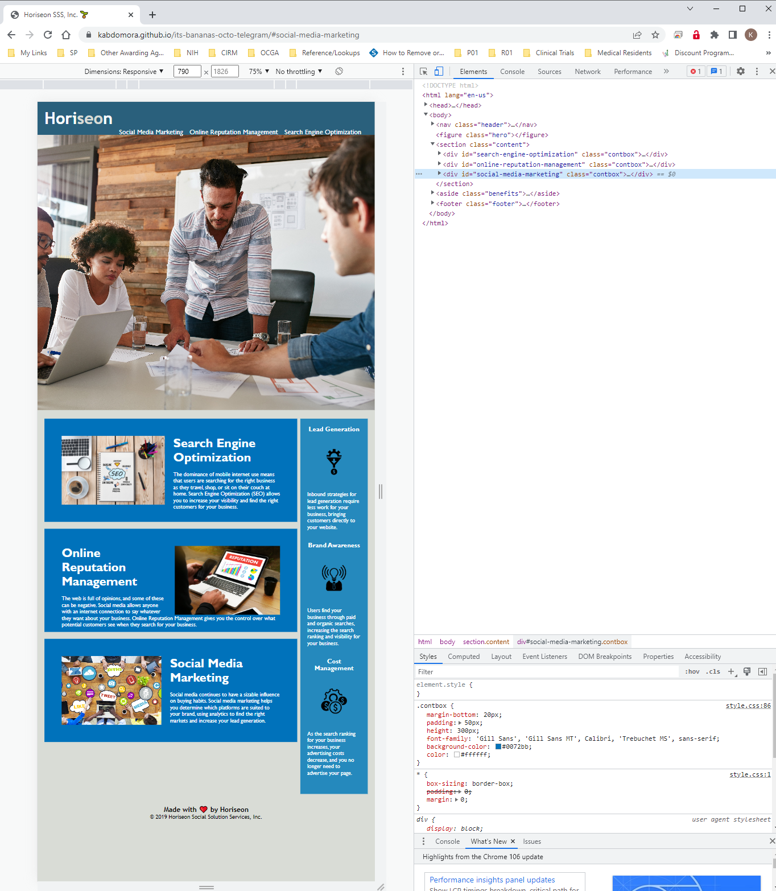

# its-bananas-octo-telegram
Module 1 Challenge

<!-- User Story -->
AS A marketing agency
I WANT a codebase that follows accessibility standards
SO THAT our own site is optimized for search engines

<!-- Acceptance Criteria -->
GIVEN a webpage meets accessibility standards
WHEN I view the source code
THEN I find semantic HTML elements 👌
                    <!-- confirmed the source file uses some semantic HTML elements -->
                    <!-- broke HTML out into additional semantic elements for better design
                    Nav
                    Figure
                    Section
                    Aside
                    Footer -->
                    <!-- div and span remaining are intentional as changing to other semantic elements 
                    did not yield desired results -->

WHEN I view the structure of the HTML elements
THEN I find that the elements follow a logical structure independent of styling and positioning 👌
                    <!-- i don't find anything inherently wrong with the order of elements as-is. 
                    the order is logical to me -->
                    <!-- noting the CSS needs cleaning up, this prompt is for HTML so I assume
                    CSS order, comments, and condensing is separate -->

WHEN I view the image elements
THEN I find accessible alt attributes 👌
                    <!-- added these to 6 images. -->
                    <!-- not possible to add this to the css background image -->

WHEN I view the heading attributes
THEN they fall in sequential order 👌
                    <!-- footer updated to h4 -->

WHEN I view the title element
THEN I find a concise, descriptive title 👌
                    <!-- Changed this to Horiseon SSS (for Social Solution Services), Inc. -->

This Challenge is graded based on the following criteria:

<!-- Technical Acceptance Criteria: 40% -->
Satisfies all of the preceding acceptance criteria plus the following code improvements:

Application's links all function correctly.👌

Application's CSS selectors and properties are consolidated and organized to follow semantic structure. 👌

Application's CSS file is properly commented. 👌

<!-- Deployment: 32% -->
Application deployed at live URL. 👌

Application loads with no errors. 👌

Application GitHub URL submitted. 👌

GitHub repository that contains application code. 👌

<!-- Application Quality: 15% -->
Application resembles (at least 90%) screenshots provided in challenge instructions. 👌

<!-- Repository Quality: 13% -->
Repository has a unique name. 👌

Repository follows best practices for file structure and naming conventions. 👌

Repository follows best practices for class/id naming conventions, indentation, quality comments, etc. 👌

Repository contains multiple descriptive commit messages. 👌

Repository contains a quality README file with description, screenshot, and link to deployed application. 👌

Deployed link: https://kabdomora.github.io/its-bananas-octo-telegram/#social-media-marketing 
Deployed screenshot: 

<!-- You are required to submit BOTH of the following for review: -->

The URL of the deployed application.

The URL of the GitHub repository that contains your code. Give the repository a unique name and include a README file that describes the project.